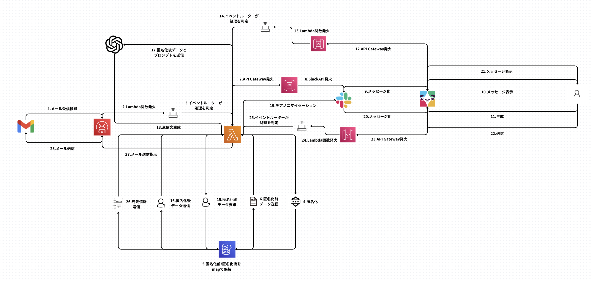
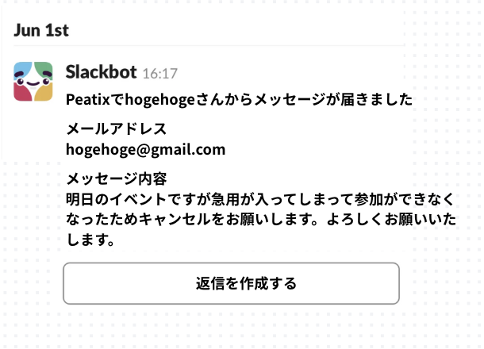
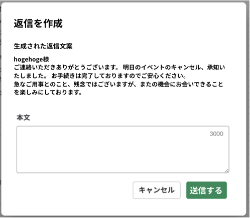

# Slack AI Eメールアシスタント 📧🤖

OpenAIを活用し、顧客からのEメール問い合わせへの返信業務を自動化・効率化するサーバーレスアプリケーションです。生成された返信文案はSlack上で人間がレビュー、編集、承認する\*\*Human-in-the-Loop (HITL)\*\*のプロセスを組み込んでおり、業務効率と応答品質の両立を実現します。

-----

## 概要

このシステムは、AWS Simple Email Service (SES)で受信した問い合わせメールをトリガーに、AWS Lambda関数がOpenAI APIを利用して返信文案を自動生成します。生成された文案はSlackに通知され、担当者は内容を確認・編集した上で、ボタン一つで実際の返信メールを送信できます。

アーキテクチャはAWS上の完全なサーバーレス・イベント駆動型で構成されており、スケーラビリティとコスト効率に優れています。

-----

## 主な特徴

  * **完全サーバーレス**: AWS Lambda、SES、DynamoDB、API Gatewayを活用し、運用オーバーヘッドを削減。
  * **Human-in-the-Loop (HITL)**: AIが生成した文案をSlack上で人間が承認・編集するプロセスを導入し、品質を担保。
  * **PII（個人識別情報）の自動マスキング**: 外部AIモデルにメール本文を渡す前に、Microsoft Presidioライブラリを用いてPIIを自動的に検出し、プレースホルダーに置き換えます。これにより、機密情報を安全に取り扱います。
  * **Infrastructure as Code (IaC)**: Terraformを用いて全てのインフラをコードで定義し、再現性とバージョン管理を保証。
  * **CI/CDパイプライン**: GitHub Actionsによる自動化されたテストとデプロイパイプラインを構築。
  * **高い回復力**: 非同期処理にデッドレターキュー（DLQ）を設定し、予期せぬエラーによるデータ損失を防止。
  * **優れたオブザーバビリティ**: 構造化ロギングと相関IDにより、リクエストの追跡が容易。ビジネスリスクに直結するSESのレピュテーションメトリクスなど、重要な指標をCloudWatchで監視します。

-----

## アーキテクチャと動作フロー



本システムは、メール受信（非同期イベント）とSlackからの操作（同期的HTTPリクエスト）という2種類のイベントを単一のLambda関数で処理する「デュアルイングレス」モデルを採用しています。

### 動作シーケンス

1.  **メール受信**: `SES`が指定アドレスへのメールを受信し、`Lambda`関数を非同期で起動します。
2.  **コンテキスト保存**: `Lambda`はメール内容（宛先、件名など）とPIIの対応表（pii\_map）を`DynamoDB`に保存し、一意な`context_id`を取得します。
3.  **Slack通知**: `Lambda`は`context_id`を埋め込んだボタン付きのメッセージをSlackに投稿します。


4.  **返信生成**: ユーザーがSlackの「返信文を生成する」ボタンをクリックすると、`API Gateway`経由で`Lambda`が起動されます。
5.  **AI連携**: `Lambda`は`context_id`を基に`DynamoDB`からコンテキストを復元し、PIIをマスキングした上でメール本文を`OpenAI` APIに渡し、返信文案を生成させます。
6.  **レビューと編集**: `Lambda`は生成された文案をSlackモーダル（ポップアップウィンドウ）に表示します。ユーザーはこのモーダル上で内容を自由に編集できます。


7.  **メール送信**: ユーザーが「送信」ボタンをクリックすると、再度`API Gateway`経由で`Lambda`が起動されます。
8.  **最終処理**: `Lambda`は編集された最終的なテキストと`DynamoDB`に保存されていた宛先情報（PIIを復元）を使って、`SES`経由で返信メールを送信します。

-----

## セットアップとデプロイ

### 前提条件

  * AWSアカウント
  * Terraform
  * OpenAI APIキー
  * Slackワークスペースとアプリ作成権限

### デプロイ手順

本プロジェクトはTerraformを用いてインフラを管理しています。

1.  リポジトリをクローンします。
2.  `staging.tfvars`や`prod.tfvars`などの環境変数ファイルを作成し、AWSアカウントID、OpenAI APIキーの保存先（Secrets ManagerのARN）、Slackの資格情報などを設定します。
3.  Terraform Workspaceを使用してデプロイ対象の環境を選択します。
    ```bash
    terraform workspace select staging
    ```
4.  Terraformコマンドを実行してインフラをプロビジョニングします。
    ```bash
    terraform init
    terraform plan -var-file="staging.tfvars"
    terraform apply -var-file="staging.tfvars"
    ```

GitHub Actionsを用いたCI/CDパイプラインも定義されており、リポジトリへのプッシュをトリガーに自動でテストとデプロイが実行されます。


-----

## セキュリティ

本システムはセキュリティを最優先に設計されています。

  * **IAM最小権限**: Lambda実行ロールには、CloudWatch Logs、DynamoDB、Secrets Manager、SESへのアクセスなど、必要最低限の権限のみが付与されます。
  * **機密情報管理**: OpenAI APIキーなどのシークレットはAWS Secrets Managerで安全に管理されます。
  * **メール送信ドメイン認証**: SESの送信ドメインには、なりすましを防ぎ、到達率を高めるために**SPF**、**DKIM**、**DMARC**レコードの設定が必須です。
  * **データ暗号化**: DynamoDBに保存されるデータは保存時に暗号化（Encryption at Rest）が有効化されます。