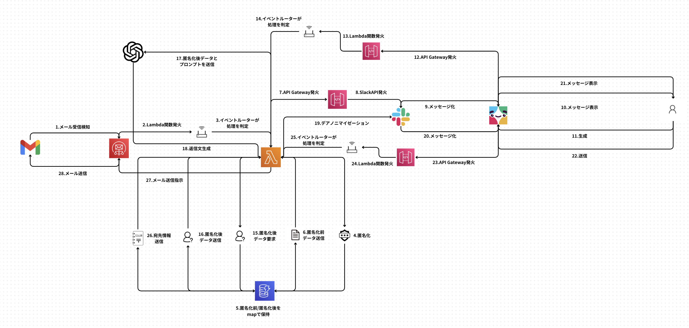
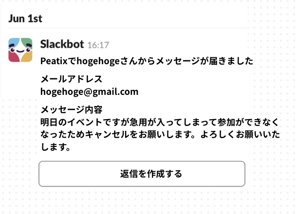
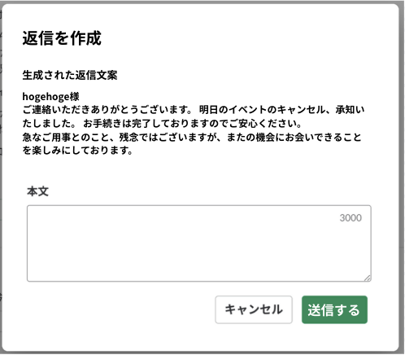

# お問い合わせ自動返信SlackBot

OpenAI を活用し、顧客からの E メール問い合わせへの返信業務を自動化・効率化するサーバーレスアプリケーションです。生成された返信文案は Slack 上で人間がレビュー・編集・承認する Human-in-the-Loop (HITL) のプロセスを備え、効率と品質を両立します。

---

## 概要

本システムは AWS と GCP を組み合わせたハイブリッド構成です。

- 受信メールの取り込みは「AWS SES」または「Gmail Poller（Gmail API）」のいずれかを選択できます。
- Slack インタラクションの受付と非同期生成のトリガーは「GCP Cloud Run Service/Job」で処理します。
- メールの送信は AWS SES、問い合わせコンテキストの保存は Amazon DynamoDB を使用します。
- 機密情報は AWS Secrets Manager もしくは GCP Secret Manager に安全に保存します。

---

## 主な特徴

- 完全サーバーレス（ハイブリッド）:
  - AWS: SES, Lambda, DynamoDB, API Gateway（従来入口）
  - GCP: Cloud Run Service（Slackエントリ）, Cloud Run Job（非同期生成）, Secret Manager
- 非同期 AI 生成（推奨）:
  - Slack API の 3 秒制限を回避するため、Cloud Run Job で非同期に生成
- Human-in-the-Loop (HITL):
  - 生成文案を Slack モーダルでレビュー・編集・承認
- PII（個人識別情報）の自動マスキング:
  - Microsoft Presidio による検出と置換
- IaC と CI/CD:
  - Terraform による再現可能なインフラ
  - GitHub Actions によるテスト・デプロイ
- オブザーバビリティと回復力:
  - 構造化ロギング、相関 ID、DLQ 設計（非同期）

---

## アーキテクチャと動作フロー



### イベント経路（取り込み）

- SES 経路:
  1) SES 受信 → 2) Lambda で PII マスキング・DynamoDB 保存 → 3) Slack に通知
- Gmail Poller 経路:
  - 定期実行の Lambda で Gmail API から未読を取得、PII マスキング・DynamoDB 保存後に Slack に通知

参考: `src/app/gmail_poller.py`

### Slack 経路（非同期生成・推奨）

1. ユーザーが Slack の「返信文を生成する」ボタンをクリック
2. Cloud Run Service がモーダルを即時オープン（< 1 秒）
3. Cloud Run Job がバックグラウンドで AI 生成（5–15 秒）
4. 完了後、モーダル/メッセージを更新

詳細は `ASYNC_WORKFLOW_DOCUMENTATION.md` を参照

### Cloud Run Service の公開エンドポイント

- `GET /health` ヘルスチェック
- `POST /slack/events` Slack Events API と Interactive Components の入口
- `POST /async/generate` AWS 側（Lambda 等）から非同期生成をトリガーするための入口

実装: `cloudrun/service/main.py`

---

## セットアップとデプロイ

### 前提条件

- AWS アカウント（SES, DynamoDB, Secrets Manager）
- GCP プロジェクト（Cloud Run, Secret Manager, Artifact Registry, Cloud Build）
- Terraform, `gcloud` CLI, Docker
- OpenAI API キー
- Slack ワークスペースとアプリ作成権限
- 送信ドメイン（SES 認証）または Gmail OAuth クレデンシャル

### クイックスタート（ハイレベル）

1. リポジトリを取得
   ```bash
   git clone https://github.com/your-org/reply_bot.git
   cd reply_bot
   ```

2. GCP 側（Cloud Run）のデプロイ
   - Cloud Run Service/Job・Secret Manager のセットアップ
   - ガイド: `CLOUD_RUN_DEPLOYMENT.md` / `cloudrun/README.md`

3. AWS 側（SES/DynamoDB/Lambda など）のプロビジョニング
   - Terraform によるインフラ設定と適用
   - ガイド: `.github/DEPLOYMENT_GUIDE.md` / `DEPLOYMENT_CHECKLIST.md`

4. Secrets の設定
   - AWS Secrets Manager・GCP Secret Manager 双方に必要な値を保存
   - ガイド: `.github/SECRETS_MANAGER_SETUP.md` / `.github/SECRETS_SETUP.md`

5. Slack アプリ設定とルーティング
   - Request URL を Cloud Run の `/slack/events` に設定
   - ガイド: `.github/SLACK_APP_SETUP.md` / `SLACK_ROUTING_MIGRATION.md`

6. （オプション）Gmail Poller を有効化
   - `get_refresh_token.py` で Gmail OAuth の `refresh_token` を取得し Secret に保存
   - Poller 用 Lambda の実行/スケジューリングを設定

7. 非同期エンドポイント（Lambda → Cloud Run）の有効化
   - Lambda の環境変数に `ASYNC_GENERATION_ENDPOINT` と `ASYNC_GENERATION_AUTH_HEADER` を設定
   - ガイド: `ASYNC_ENDPOINT_SETUP.md`

### 便利スクリプト

```bash
# Secrets Manager の対話設定
./scripts/setup-secrets.sh staging --interactive

# デプロイ検証（AWS 側）
./scripts/validate-deployment.sh staging --all

# Slack Request URL の更新補助
./scripts/update-slack-request-url.sh -e staging -u "https://<cloud-run-url>" -t "xoxb-..."
```

---

## メール取り込みオプション

### 1) SES 経路（推奨）

- 受信 → Lambda → PII マスキング → DynamoDB 保存 → Slack 通知
- SES 送信ドメインの認証（SPF/DKIM/DMARC）を設定
- 参考: `.github/SES_DOMAIN_SETUP.md`

### 2) Gmail Poller 経路

- `src/app/gmail_poller.py`（Lambda/スケジュールで未読取得）
- 前準備:
  - `client_secret_*.json` を配置し、`get_refresh_token.py` で `refresh_token` を取得
  - Secrets に以下 JSON を保存:
    ```json
    {
      "client_id": "...",
      "client_secret": "...",
      "refresh_token": "..."
    }
    ```
- 処理: 未読取得 → PII マスキング → DynamoDB 保存 → Slack 通知

---

## 環境変数（例）

- 共通（AWS 側 Lambda など）
  - `SLACK_SIGNING_SECRET_ARN`, `SLACK_APP_SECRET_ARN`
  - `OPENAI_API_KEY_SECRET_ARN`
  - `DDB_TABLE_NAME`, `SENDER_EMAIL_ADDRESS`, `SLACK_CHANNEL_ID`
  - `GMAIL_OAUTH_SECRET_ARN`（Gmail Poller 利用時）
  - `ASYNC_GENERATION_ENDPOINT`, `ASYNC_GENERATION_AUTH_HEADER`

- Cloud Run Service/Job（GCP 側）
  - `GCP_PROJECT_ID`, `GCP_REGION`, `CLOUD_RUN_JOB_NAME`, `SERVICE_ACCOUNT_EMAIL`
  - `SLACK_SIGNING_SECRET_NAME`, `SLACK_BOT_TOKEN_SECRET_NAME`
  - `AWS_ACCESS_KEY_ID_SECRET_NAME`, `AWS_SECRET_ACCESS_KEY_SECRET_NAME`
  - `AWS_REGION`, `DDB_TABLE_NAME`, `STAGE`, `SLACK_CHANNEL_ID`

詳細: `CLOUD_RUN_DEPLOYMENT.md`

---

## セキュリティ

- 秘密情報管理:
  - AWS 側の機密は AWS Secrets Manager、GCP 側は GCP Secret Manager で管理
  - 認証トークンの定期ローテーション
- IAM 最小権限:
  - AWS IAM / GCP サービスアカウントともに必要最小限の権限付与
- メール送信ドメインの保護:
  - SES の SPF/DKIM/DMARC を必須化
- PII 保護:
  - Presidio による検出・置換、復元は返信直前のみ

---

## テストと CI/CD

- ローカルテスト
  ```bash
  pip install -r requirements.txt
  pytest tests/ -v
  ```
- GitHub Actions による Lint/Unit Test/Terraform Plan/Apply が `develop`（staging）と `main`（production）に連動
  - 設定: `.github/workflows/deploy.yml`

---

## トラブルシューティング（抜粋）

- Cloud Run の健全性:
  ```bash
  curl https://<cloud-run-url>/health
  ```
- 非同期生成の疎通:
  ```bash
  curl -X POST https://<cloud-run-url>/async/generate \
    -H "Content-Type: application/json" \
    -H "Authorization: Bearer <auth-token>" \
    -d '{"context_id":"test","external_id":"ai-reply-test","stage":"staging"}'
  ```
- 参考ドキュメント:
  - `CLOUD_RUN_DEPLOYMENT.md`
  - `SLACK_ROUTING_MIGRATION.md`
  - `DEPLOYMENT_CHECKLIST.md`
  - `.github/DEPLOYMENT_GUIDE.md`
  - `ASYNC_WORKFLOW_DOCUMENTATION.md`
  - `ASYNC_ENDPOINT_SETUP.md`

---

## 参考: 主要ディレクトリ

- `cloudrun/service/`: Slack エントリ（Flask, `/slack/events`, `/async/generate`, `/health`）
- `cloudrun/job_worker/`: 非同期生成ワーカー
- `src/app/`: 共有ロジック（`common/`, `slack/`, `gmail_poller.py` など）
- `infra/terraform/`: IaC（AWS/GCP）
- `tests/`: ユニットテスト
- `scripts/`: Secrets 設定や Slack URL 更新などの補助スクリプト

---

## 画像

- 問い合わせ通知: 
- 返信モーダル: 
- 送信完了: 